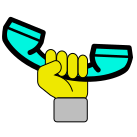

# Cato

## A static file web server with live-reload (for development)

### What does it do?

- It serves via http the contents of a certain directory.

- It implements live-reload.
 
### What is Live Reload?

Live reload is a feature that automatically reloads a page in the browser if you change that page on the file-system.

### How does Live Reload actually work?

Cato embeds a little javascript in every html page that it serves. 
This script opens up a websocket with cato, and listens for messages.
If a message is received, it reloads the page.
Cato listens for file system-changes in the directory containing the files that are being served.
When cato detects a change, it sends a message to each connected websocket, which causes each page to be reloaded.

### How to use?

- Begin with `dotnet tool install cato`.  (Specify `--tool-path` if you do not want to be bothered with manifest file crap.)

- Run cato in a directory to serve that directory at http://localhost:8080

- Run with `--help` to see available options.

-----

Named "Cato" after [Cato Fong](https://en.wikipedia.org/wiki/List_of_The_Pink_Panther_characters#Cato_Fong), the trusted 
sidekick of inspector Clouseau in the first line of the Pink Panther movies.

-----

Cover image: The Cato logo, by michael.gr, 
based on ["Fist" by Maxim Kulikov from the Noun Project](https://thenounproject.com/icon/fist-1316322/) ([CC BY 3.0](https://creativecommons.org/licenses/by/3.0/deed.en)) 
and ["Phone" by Lesha Petrick from the Noun Project](https://thenounproject.com/icon/phone-1397798/) ([CC BY 3.0](https://creativecommons.org/licenses/by/3.0/deed.en))
